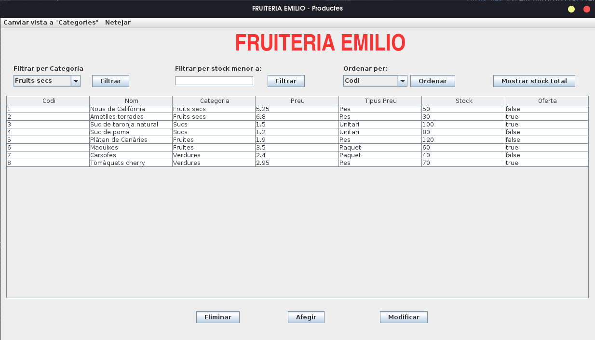

# 🍏 FRUITERIA EMILIO

Check the project information and setup instructions of the application in the following languages:

- [English](#en) 

- [Spanish](#es)

- [Catalan](#cat)

<a name="en"><h3>About this project</h3></a>

**Fruiteria Emilio** was my last Java project when I was coursing first year of Web Applications Development vocational course.

We were demanded to make a Java application for **Emilio**, a local fruitshop owner who needs an app to manage the products he sells.

### 🛠️ Tech Stack
- **Language:** Java 21  
- **Database:** MySQL 8.0.43
- **IDE:** Apache NetBeans  
- **Architecture:** DAO (Data Access Object pattern), MVC (Model, View, Controller)  
- **UI:** Java Swing  
- **Build Tool:** Ant

### 🍎 Features

The app must be able to:

- Add new products

- Edit products

- Delete products

- Add new categories

- Modify categories

- Delete categories (only if there are no products associated with that category, the app will notify to the user if there are associated products and must not allow to delete that category).

- Filter by category and stock lower than a number given by the user.

- Sort by all table fields.

- Show stock's total price.

- Topbar to switch between products and categories views and clean up filters.

### 👀 Prerequisites

- [JDK 21 or higher](https://www.oracle.com/es/java/technologies/downloads/)

- [Apache Netbeans](https://netbeans.apache.org/front/main/download/nb27/)

- [MySQL Server](https://dev.mysql.com/downloads/mysql/8.0.html)

- [Git](https://git-scm.com/downloads) (used to be installed in most Linux Distros, for Windows install Git Bash)

### ⚙️ Installation

Run a terminal (or Git Bash if you are using Windows) and clone the repository:

```bash
git clone https://github.com/rxnwashere/fruiteria-emilio.git
```

Run MySQL from a command line or open your database design tool (MySQL Workbench, PHPMyAdmin...) and create the database that will be used by the application:

```mysql
CREATE DATABASE IF NOT EXISTS fruiteria_emilio;
```

You don't need to create any tables, the application will do it for you after run it :)

Open Apache Netbeans and open the project, then go to <code>Connection.java</code> located in <code>DAO</code> package.

Change connection credentials to your MySQL ones:

```java
/*
 * Click nbfs://nbhost/SystemFileSystem/Templates/Licenses/license-default.txt to change this license
 * Click nbfs://nbhost/SystemFileSystem/Templates/Classes/Class.java to edit this template
 */
package DAO;

import java.sql.DriverManager;
import java.sql.SQLException;

/**
 *
 * @author aaroncanofdez
 */
public class Connection {
    static final String driver = "com.mysql.cj.jdbc.Driver";
    static final String url = "jdbc:mysql://localhost:3306/";
    static final String dbName = "fruiteria_emilio";    
    static final String userName = "root"; // <-- Change this
    // static final String password = "root";
    static final String password = "P@ssw0rd*"; // <-- Change this
    // static final String password = "server";

    protected static java.sql.Connection conn = null;

    public static void connect() {
        if (conn == null) {
            try {
                Class.forName(driver);
                conn = DriverManager.getConnection(url + dbName, userName, password);
            } catch (SQLException | ClassNotFoundException ex) {
                throw new ExceptionInInitializerError(ex);
            }
        }
    }

    public static java.sql.Connection getConn() {
        return conn;
    }

    public static void close() throws SQLException {
        if (conn != null) {
            conn.close();
        }
        conn = null;
    }
}
```

### ⏩ Usage
Once you followed installation steps, you can run the project pressing <code>F6</code> key. You can also <code>Clean and build</code> the project and locate the JAR file at <code>./fruiteria-emilio/CanoFernandezAaron_ProjecteFinal/dist</code>, double click on it to run it on Windows or open a terminal in Linux and run:

```bash
java -jar CanoFernandezAaron_ProjecteFinal.jar
```

**Productes (Products) Screen:**



**Filter by category:**


### 👤 Author
**Aarón Cano Fernández (rxnwashere)**  
💻 Student of Web Application Development (DAW)  
📍 Barcelona, Spain  
[GitHub Profile](https://github.com/rxnwashere)

**Still writing <code>README.md</code>, it's possible that this version of the file can't be the final one.**