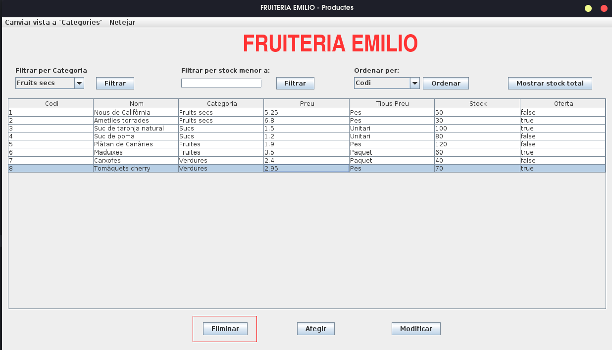
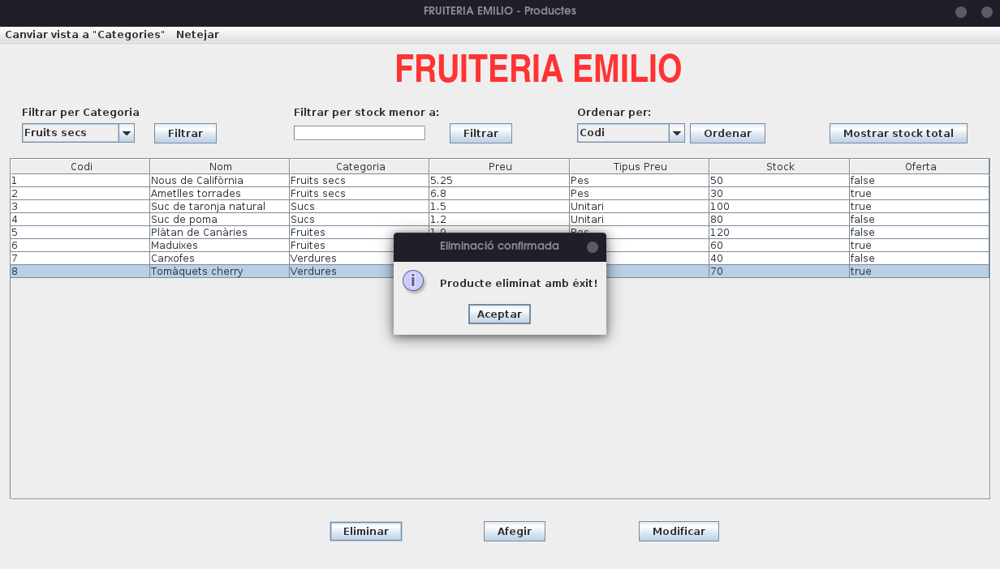

# 🍏 FRUITERIA EMILIO

Check the project information and setup instructions of the application in the following languages:

- [English](#en) 

- [Spanish](#es)

- [Catalan](#cat)

<a name="en"><h3>About this project</h3></a>

**Fruiteria Emilio** was my last Java project when I was coursing first year of Web Applications Development vocational course.

We were demanded to make a Java application for **Emilio**, a local fruitshop owner who needs an app to manage the products he sells and execute CRUD operations easily with a UI.

---

### 🛠️ Tech Stack
- **Language:** Java 21  
- **Database:** MySQL 8.0.43
- **IDE:** Apache NetBeans  
- **Architecture:** DAO (Data Access Object pattern), MVC (Model, View, Controller)  
- **UI:** Java Swing  
- **Build Tool:** Ant

---

### 📁 Project structure

```
CanoFernandezAaron_ProjecteFinal/
├── build/     # Temporary build files generated by NetBeans
├── dist/      # Compiled .jar and distribution files
├── driver/    # MySQL JDBC driver (.jar) used for database connection
├── nbproject/ # NetBeans project configuration files (build paths, libraries, etc.)
├── src/       # Main source code
│   ├── Controller/  # Controllers handling logic between the view and model
│   ├── DAO/         # Data Access Objects (database interaction layer)
│   ├── Model/       # Java objects and classes representing database entities (Product and Category)
│   └── View/        # Swing-based UI forms (product view, category view, dialogs, etc.)
├── build.xml        # Ant build script
└── manifest.mf      # Manifest file for executable .jar metadata
```

---

### 🍎 Features

The app must be able to:

- Add new products

- Edit products

- Delete products

- Add new categories

- Modify categories

- Delete categories (only if there are no products associated with that category, the app will notify to the user if there are associated products and must not allow to delete that category).

- Filter by category and stock lower than a number given by the user.

- Sort by all table fields.

- Show stock's total price.

- Topbar to switch between products and categories views and clean up filters.

---

### 👀 Prerequisites

- [JDK 21 or higher](https://www.oracle.com/es/java/technologies/downloads/)

- [Apache Netbeans](https://netbeans.apache.org/front/main/download/nb27/)

- [MySQL Server](https://dev.mysql.com/downloads/mysql/8.0.html)

- [Git](https://git-scm.com/downloads) (used to be installed in most Linux Distros, for Windows install Git Bash)

---

### ⚙️ Installation

Run a terminal (or Git Bash if you are using Windows) and clone the repository:

```bash
git clone https://github.com/rxnwashere/fruiteria-emilio.git
```

Run MySQL from a command line or open your database design tool (MySQL Workbench, PHPMyAdmin...) and create the database that will be used by the application:

```mysql
CREATE DATABASE IF NOT EXISTS fruiteria_emilio;
```

You don't need to create any tables, the application will do it for you after run it with data entries to test app usage :)

Open Apache Netbeans and open the project, then go to <code>Connection.java</code> located in <code>DAO</code> package.

Change connection credentials to your MySQL ones:

```java
/*
 * Click nbfs://nbhost/SystemFileSystem/Templates/Licenses/license-default.txt to change this license
 * Click nbfs://nbhost/SystemFileSystem/Templates/Classes/Class.java to edit this template
 */
package DAO;

import java.sql.DriverManager;
import java.sql.SQLException;

/**
 *
 * @author aaroncanofdez
 */
public class Connection {
    static final String driver = "com.mysql.cj.jdbc.Driver";
    /*If your database is hosted in a remote host change
    url value*/
    static final String url = "jdbc:mysql://localhost:3306/";
    static final String dbName = "fruiteria_emilio";    
    static final String userName = "root"; // <-- Change this
    // static final String password = "root";
    static final String password = "P@ssw0rd*"; // <-- Change this
    // static final String password = "server";

    protected static java.sql.Connection conn = null;

    public static void connect() {
        if (conn == null) {
            try {
                Class.forName(driver);
                conn = DriverManager.getConnection(url + dbName, userName, password);
            } catch (SQLException | ClassNotFoundException ex) {
                throw new ExceptionInInitializerError(ex);
            }
        }
    }

    public static java.sql.Connection getConn() {
        return conn;
    }

    public static void close() throws SQLException {
        if (conn != null) {
            conn.close();
        }
        conn = null;
    }
}
```

---

### ⏩ Usage
Once you followed installation steps, you can run the project pressing <code>F6</code> key. You can also <code>Clean and build</code> the project and locate the JAR file at <code>./fruiteria-emilio/CanoFernandezAaron_ProjecteFinal/dist</code>, double click on it to run it on Windows or open a terminal in Linux and run:

```bash
java -jar CanoFernandezAaron_ProjecteFinal.jar
```

**Productes (Products) Screen:**


---

#### 🔎 Filters

**Filter by category:**


**Filter by stock lower than a given number:**


**Order by specific field:**


---

#### 💯 Total stock

Shows total stock price in euros (EUR €).


---

#### 🧹 Clean up filters


---

#### ➕ Add new product

Clicking the middle button located at the bottom of the window we can add a new product to the database.


The new product must have the next fields:

- **Code** : Automatically assigned by the system when you create a new product
- **Name (Nom)** : Text field that will identify clearly the product.
- **Category (Categoria)** : Drop-down list that references the <code>Categoria</code> table, allowing products to be grouped by type.
- **Price (Preu)** : Indicates how much it costs the product.
- **Price type (tipus preu)** : Radio buttons that specify how the price is applied.
- **Stock** : Indicates the amount of product available in inventory.
- **On sale (Oferta)** : Checkbox to mark if the product is currently on sale (true/false).

**⚠️ All fields are required! If you left one of them the system will warn you and will not allow you to add the product:**


**⚠️ For product price and stock will also warn you if you try to input text on them empty. Stock only allows integers and price allows integers and doubles (decimals):**


Once you fill all fields with valid data the product will be added to the database:


---

#### ✏️ Modify product

Next to **Add new product button (Afegir)** we will find **Modify product button (Modificar)**:


**⚠️ Important: We must select the product we want to update, if we don't the system will warn us:**


After selecting the product and clicking the button, it will show up a similar window like before when we added a new product, it will charge with the selected product data and we will be able to modify it following the same requirements as adding ones.

<code>Modifying item with Code 6 and name Maduixes:</code>


--- 

#### ❌ Delete product

Selecting a product like before and clicking the next button we can delete a product:



We will be asked to confirm the operation:





---

#### 🔁 Switch to categories view

Locate at topbar and press <code>Canviar vista a Categories</code>, the dropdown will show you an option, click on it and you will be switched to categories view:


Once you are in categories view you can switch back to products doing the same as before.

---


---

### 👤 Author
**Aarón Cano Fernández (rxnwashere)**  
💻 Student of Web Application Development (DAW)  
📍 Barcelona, Spain  
[GitHub Profile](https://github.com/rxnwashere)

**Still writing <code>README.md</code>, it's possible that this version of the file can't be the final one.**